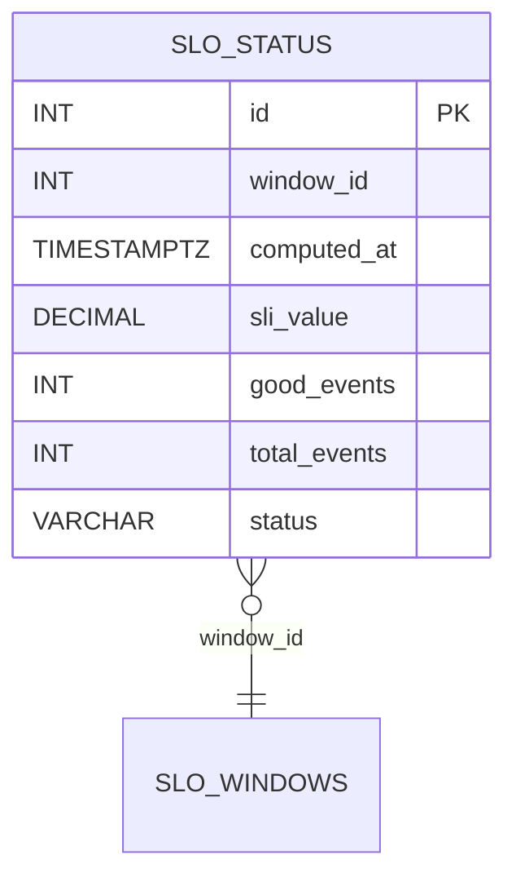

# 📦 Slo Status

   

<!-- Auto-generated from schema-map-postgres.psd1 @ 62c9c93 (2025-11-20T21:38:11+01:00) -->

> Schema package for table **slo_status** (repo: `slo-status`).

## Files
```
schema/
  001_table.sql
  020_indexes.sql
  030_foreign_keys.sql
```

## Quick apply
```bash
# Apply schema (Linux/macOS):
mysql -h "$DB_HOST" -u "$DB_USER" -p"$DB_PASS" "$DB_NAME" < schema/001_table.sql
mysql -h "$DB_HOST" -u "$DB_USER" -p"$DB_PASS" "$DB_NAME" < schema/020_indexes.sql
mysql -h "$DB_HOST" -u "$DB_USER" -p"$DB_PASS" "$DB_NAME" < schema/030_foreign_keys.sql
```

```powershell
# Apply schema (Windows PowerShell):
mysql -h $env:DB_HOST -u $env:DB_USER -p$env:DB_PASS $env:DB_NAME < schema/001_table.sql
mysql -h $env:DB_HOST -u $env:DB_USER -p$env:DB_PASS $env:DB_NAME < schema/020_indexes.sql
mysql -h $env:DB_HOST -u $env:DB_USER -p$env:DB_PASS $env:DB_NAME < schema/030_foreign_keys.sql
```

## Docker quickstart
```bash
# Spin up a throwaway MySQL and apply just this package:
docker run --rm -e MYSQL_ROOT_PASSWORD=root -e MYSQL_DATABASE=app -p 3307:3306 -d mysql:8
sleep 15
mysql -h 127.0.0.1 -P 3307 -u root -proot app < schema/001_table.sql
mysql -h 127.0.0.1 -P 3307 -u root -proot app < schema/020_indexes.sql
mysql -h 127.0.0.1 -P 3307 -u root -proot app < schema/030_foreign_keys.sql
```

## Columns
| Column | Type | Null | Default | Extra |
|-------:|:-----|:----:|:--------|:------|
| id | BIGINT | — | AS | PK |
| window_id | BIGINT | NO | — |  |
| computed_at | TIMESTAMPTZ(6) | NO | CURRENT_TIMESTAMP(6) |  |
| sli_value | NUMERIC(18,6) | YES | — |  |
| good_events | BIGINT | NO | 0 |  |
| total_events | BIGINT | NO | 0 |  |
| status | TEXT | NO | 'unknown' |  |

## Relationships
- FK → **slo_windows** via (window_id) (ON DELETE CASCADE).



## Indexes
- 1 deferred index statement(s) in schema/020_indexes.sql.

## Notes
- Generated from the umbrella repository **blackcat-database** using `scripts/schema-map.psd1`.
- To change the schema, update the map and re-run the generators.

## License
Distributed under the **BlackCat Store Proprietary License v1.0**. See `LICENSE`.
